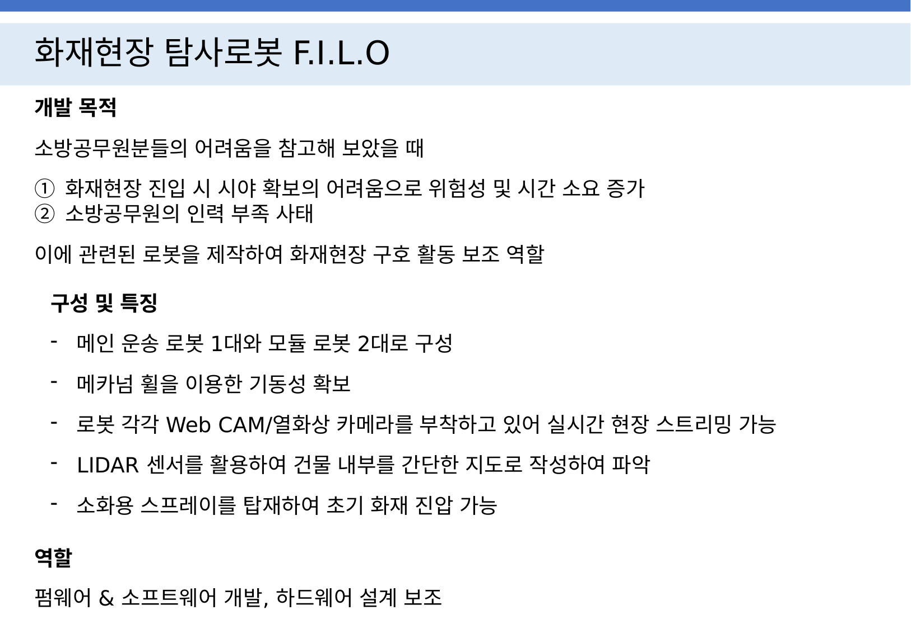
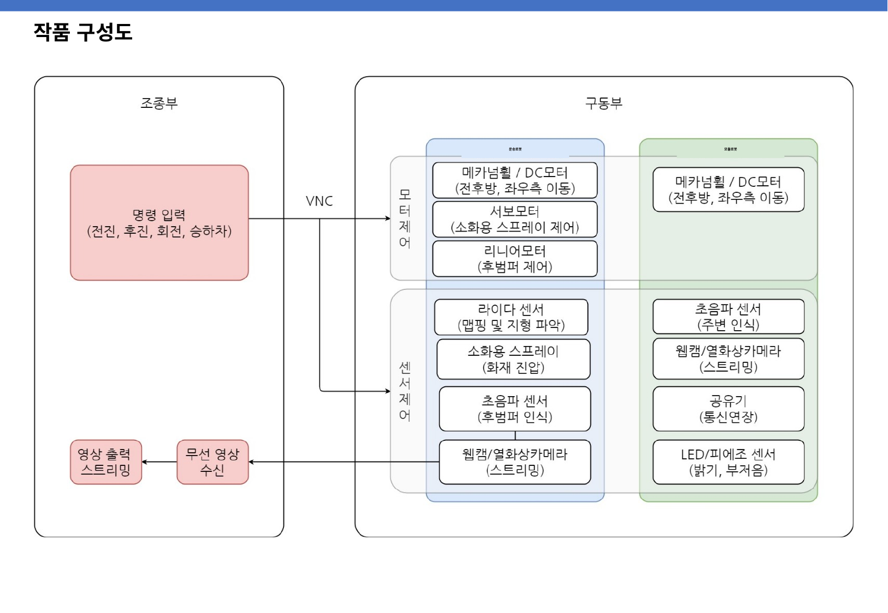
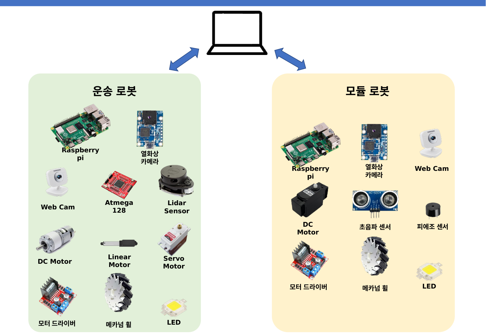
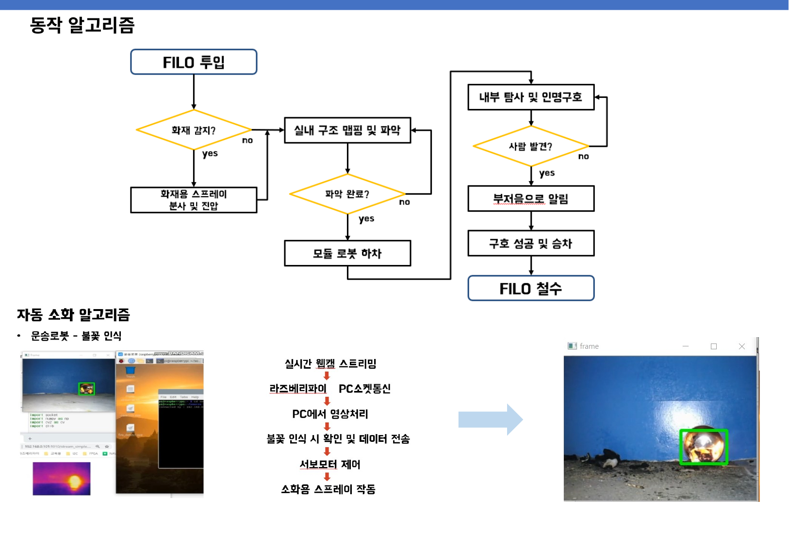
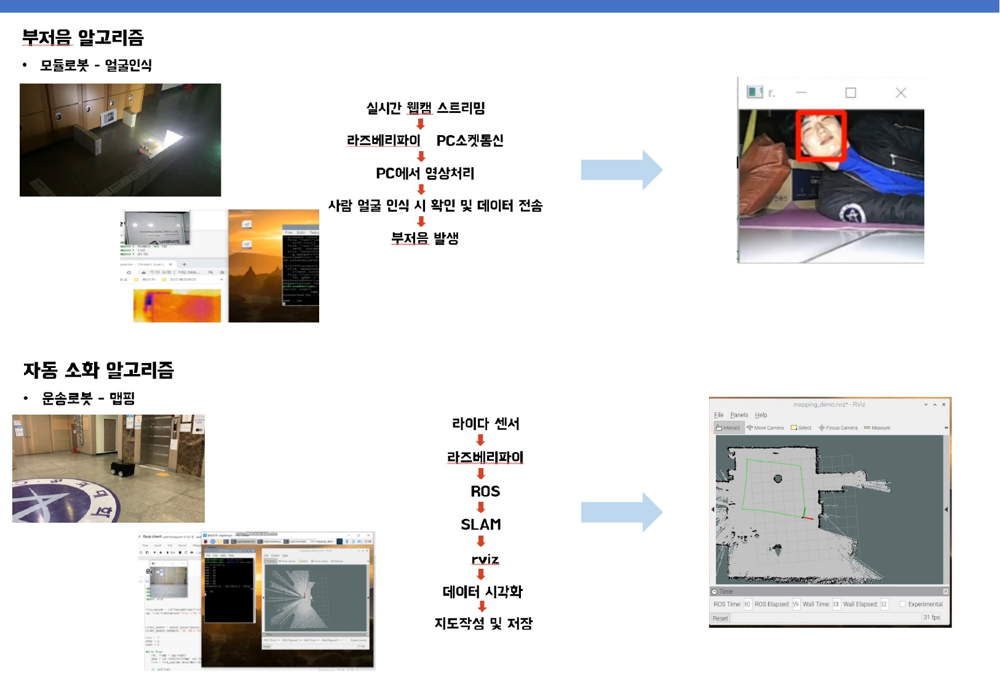
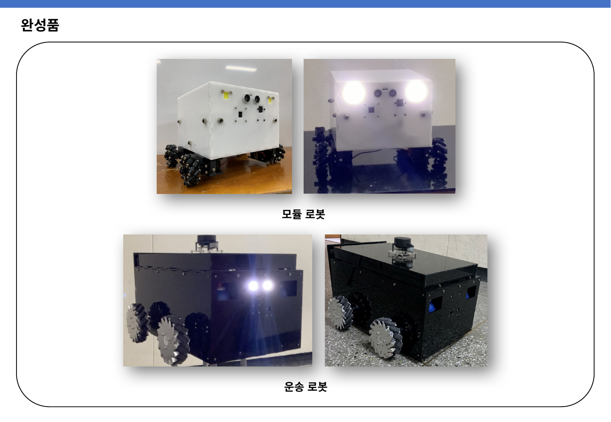

# PMOD Team FILO Project

컴퓨터비전 기반 화재·얼굴 감지와 로봇(AVR + Raspberry Pi) 제어를 통합하는 프로젝트입니다. OpenCV를 이용한 감지 모듈, AVR 마이크로컨트롤러 기반 메인 로봇, Raspberry Pi 기반 서브 로봇 코드로 구성되어 있습니다.

## 시연 영상

- YouTube: https://youtu.be/OhwHl8dKajI?si=HH-qOaXZLboRQ07H

## 디렉토리 개요

- `face_detecting`
  - 내용: 얼굴 감지 관련 Jupyter Notebook과 모델/캐스케이드 파일
  - 주요 파일:
    - `face client.ipynb`, `face.ipynb`, `face server.ipynb`: 얼굴 인식/테스트 노트북
    - `shape_predictor_68_face_landmarks.dat`: 68개 얼굴 랜드마크 예측 모델(대용량)
    - `haarcascade_fullbody.xml`, `fire_detection.xml`: OpenCV 캐스케이드 파일
  - 비고: 노트북 실행 환경(Jupyter, OpenCV, dlib 등)을 준비한 뒤 노트북에서 단계별 실행

- `fire_dectecting`  (원문 철자 유지)
  - 내용: 실시간 카메라로 화재(불꽃/빨강 계열) 감지
  - 주요 파일:
    - `fireDetection.py`: `fire_detection.xml` 캐스케이드로 화염 영역 검출
    - `fire.py`: 배경 제거 + HSV 마스크 기반 빨강 계열 감지 및 윤곽 추출
    - `fire_detection.xml`: 화재 탐지 캐스케이드 파일
    - `opencv_script.sh`: Ubuntu/Debian에서 OpenCV 3.4.2 빌드 설치 스크립트
  - 실행(예시):
    - `python3 fire_dectecting/fireDetection.py`
    - `python3 fire_dectecting/fire.py`

- `robot_src/main_robot`
  - 내용: 메인 로봇(AVR) 펌웨어와 PC-AVR 시리얼 연동 스크립트
  - 주요 파일:
    - `avr.c`: 모터 드라이버, 서보, 리니어 액추에이터, LED 제어(PWM/타이머, 시리얼 명령 수신)
    - `serial101.py`: `/dev/ttyACM0` 9600bps로 AVR에 키보드 명령 송신 + TCP 서버(`192.168.0.101:9999`)
  - 키보드 명령(일부): `w/s/a/d`(주행), `q/e/z/x`(회전/조향), `c`(정지), `h`(리니어 토글), `j/k`(서보 토글), `l`(전방 LED 토글), `r/t`(제자리 회전), `o/p`(모드 토글)

- `robot_src/sub_robot`
  - 내용: Raspberry Pi 기반 서브 로봇 제어 스크립트(모터, 초음파, LED, 버저)
  - 주요 파일:
    - `module102.py`: 소켓 서버 `192.168.0.102:9999` (RPi.GPIO로 구동)
    - `module103.py`: 소켓 서버 `192.168.0.103:9999`
  - 기능 개요:
    - 키보드 제어: `w/s/a/d`(주행), `q/e`(저속 회전), `+/-`(PWM 변경), `l`(LED), `y`(버저), `i`(초음파 측정), `f/g/o`(간단 자동 진입 흐름 제어), `c`(정지), `Esc`(종료)
    - 초음파 센서: 전/좌/우 거리 측정, 간단한 상태 머신(`stop_enter`)로 진입 동작 수행
    - 소켓 수신 시 버저/알림 처리

## 빠른 시작

- Python 가상환경
  - `python3 -m venv .venv && source .venv/bin/activate`
  - `pip install --upgrade pip`
- 필수 패키지(PC)
  - `pip install opencv-python numpy`
  - 노트북 사용 시: `pip install jupyter`
- Raspberry Pi (루트 권한 필요)
  - `sudo pip3 install RPi.GPIO`
  - 카메라/모터/초음파 연결 상태 확인 후 실행

## 실행 방법

- 화재 감지
  - `python3 fire_dectecting/fireDetection.py` (캐스케이드 기반)
  - `python3 fire_dectecting/fire.py` (HSV+배경 제거 기반)
- 얼굴 감지
  - Jupyter 실행 후 `face_detecting` 내 노트북 열기: `jupyter notebook` 또는 `jupyter lab`
- 메인 로봇(AVR)
  - `avr.c`를 AVR-GCC/AVRDUDE 등으로 보드에 빌드/업로드
  - PC에서 시리얼 연동: `python3 robot_src/main_robot/serial101.py`
  - 기본 포트: `/dev/ttyACM0`, 속도: `9600`
- 서브 로봇(Raspberry Pi)
  - `sudo python3 robot_src/sub_robot/module102.py`
  - `sudo python3 robot_src/sub_robot/module103.py`

## 네트워크/통신

- 메인 로봇 PC: `192.168.0.101:9999` (파일: `robot_src/main_robot/serial101.py`)
- 서브 로봇: `192.168.0.102:9999`, `192.168.0.103:9999` (각각 `module102.py`, `module103.py`)
- 자체 네트워크 환경에 맞게 스크립트의 IP를 수정하세요.

## 요구 사항

- 공통: Python 3.x, NumPy, OpenCV, 웹캠(카메라)
- 얼굴/화재 감지: OpenCV 설치 필요
  - 간단 설치: `pip install opencv-python`
  - 시스템 빌드(옵션): `fire_dectecting/opencv_script.sh` 참고(루트 권한/네트워크 필요)
- 메인 로봇: AVR 툴체인(AVR-GCC/AVRDUDE), 시리얼 연결
- 서브 로봇: Raspberry Pi + RPi.GPIO, 모터 드라이버, 초음파 센서, LED/버저

## 참고 및 주의

- 하드웨어 제어 코드이므로, 실제 장비 연결 상태를 먼저 확인하고 저전력/저속으로 테스트하세요.
- `fire_dectecting` 디렉토리명은 저장소 원본 표기를 그대로 사용했습니다.
- 일부 스크립트는 시리얼 포트명, IP 주소, 핀맵 등을 환경에 맞게 수정이 필요할 수 있습니다.
- 예제 스크립트에는 개선 여지가 있을 수 있으니 실제 운용 전 충분히 검증하세요.

## 라이선스

- 추후 추가 예정

## PPT 슬라이드

